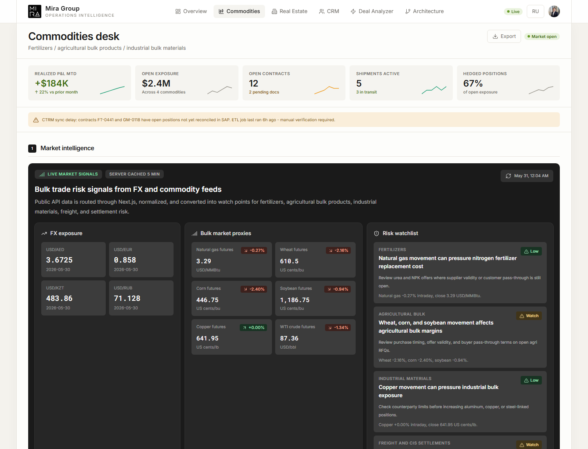
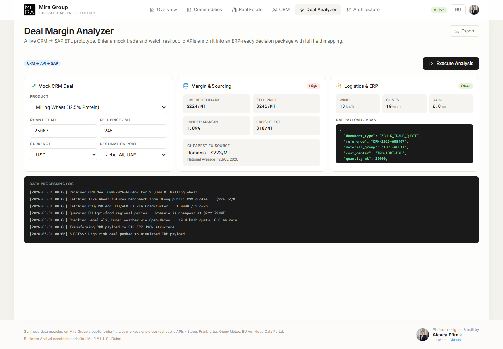
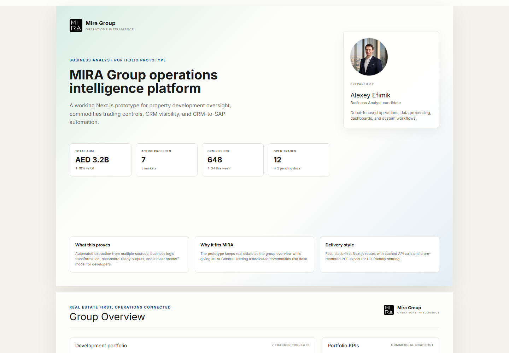

# MIRA Group Operations Intelligence Platform

A polished Business Analyst portfolio project built for a MIRA Group LLC Dubai application. The prototype turns a CV requirement into a working Next.js product: a management cockpit for real estate operations, commodities trading risk, CRM funnel visibility, and CRM-to-SAP style data processing.

**Live app:** https://mira-group-business-analyst-portfol.vercel.app  
**PDF report:** https://mira-group-business-analyst-portfol.vercel.app/mira-group-business-analyst-portfolio.pdf  
**Role focus:** Business Analyst - dashboards, CRM/SAP workflows, ETL logic, stakeholder-ready reporting


## Why This Project Exists

MIRA Group is not only a real estate brand. The group context also includes property development, broker operations, investor CRM flows, and a specialized commodities trading arm focused on fertilizers, agricultural bulk products, and industrial bulk materials.

This project demonstrates how a Business Analyst can translate that environment into a clear, executive-friendly operations platform:

- define the operating model and key data objects
- map CRM, trading, logistics, finance, and ERP handoffs
- expose management KPIs in a clean dashboard
- enrich operational decisions with live public market data
- transform mock CRM deals into SAP-ready payloads
- package the output as a polished PDF report for stakeholders

All business figures are synthetic and candidate-generated. No confidential MIRA data is used.

## Product Tour

<table>
  <tr>
    <td width="50%">
      <strong>Group Overview</strong><br>
      Real estate-first executive view with portfolio KPIs, development progress, CRM funnel, systems status, and analyst profile.
      <br><br>
      
    </td>
    <td width="50%">
      <strong>Commodities Desk</strong><br>
      Dedicated MIRA General Trading workspace for fertilizer, agricultural bulk, industrial material exposure, live FX and commodity risk signals.
      <br><br>
      
    </td>
  </tr>
  <tr>
    <td width="50%">
      <strong>Deal Margin Analyzer</strong><br>
      CRM-to-SAP ETL prototype that enriches a mock trade with market prices, FX, sourcing data, logistics risk, margin logic, and ERP payload mapping.
      <br><br>
      
    </td>
    <td width="50%">
      <strong>Static PDF Report</strong><br>
      A pre-rendered Chromium PDF export designed to look like the app, not a generic backend-generated document.
      <br><br>
      
    </td>
  </tr>
</table>

## What It Demonstrates

### Business Analysis

- requirements framing for a multi-division operating dashboard
- executive KPI selection for real estate and trading operations
- source-to-target thinking for CRM, CTRM, SAP ERP, ETL, and Power BI
- exception monitoring for sync delays, open contracts, and reconciliation risk
- stakeholder-friendly reporting with both UI and PDF deliverables

### Data And Automation

- server-side data extraction from public APIs
- normalized JSON payloads for dashboard consumption
- CRM deal enrichment with market, FX, sourcing, and logistics signals
- simulated SAP ERP payload generation
- visible processing log that explains the ETL flow step by step

### Product And Engineering

- Next.js App Router with static-first page delivery
- route handlers for API proxying and trade processing
- cached live-market endpoint with `s-maxage` and stale revalidation
- client-side interactivity only where needed
- responsive dashboard layout with a capped content width for readability
- static Chromium-rendered PDF for fast, reliable downloads

## Live Data Sources

The app uses no private credentials and no paid API keys.

- **Frankfurter API** - USD/AED, USD/EUR, USD/RUB, and USD/KZT FX context
- **Stooq public CSV quotes** - wheat, corn, soybean, copper, WTI crude, and natural gas proxies
- **EU Agri-food Data Portal** - regional agricultural and fertilizer price references
- **Open-Meteo** - port weather context for logistics and demurrage risk

The browser reads from local Next.js endpoints rather than calling third-party APIs directly:

- `GET /api/live-market`
- `POST /api/process-trade`

## Main Screens

- `/` - Group overview
- `/real-estate` - development portfolio and handover view
- `/commodities` - trading desk and live risk signals
- `/crm` - CRM funnel and broker view
- `/analyzer` - deal margin analyzer and ERP payload prototype
- `/architecture` - systems and integration view
- `/report` - print layout used to generate the static PDF

## Tech Stack

- Next.js 16 App Router
- React 19
- TypeScript
- Tailwind CSS
- Recharts
- Lucide icons
- Vercel deployment

## Run Locally

```bash
npm install
npm run dev
```

Open `http://localhost:3333` if your local server is already configured for port 3333, or use the port printed by Next.js.

## Verification

Last verified on May 31, 2026:

```bash
npm run lint
npm run build
```

Production checks:

- all public pages return `200`
- `/api/live-market` returns JSON
- `/api/process-trade` returns JSON
- static PDF export returns `application/pdf`
- legacy `/api/export?...` redirects to the PDF for compatibility

## Notes

This is a portfolio prototype, not an official MIRA Group system. It is designed to show how I approach business requirements, data flows, operational controls, stakeholder reporting, and developer-ready API/ETL collaboration.
